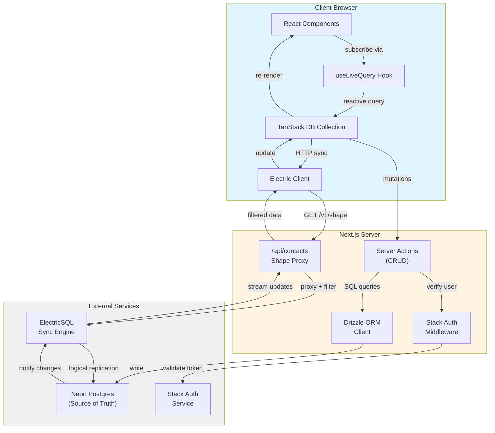
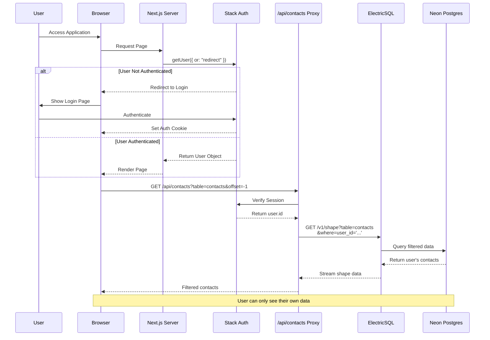
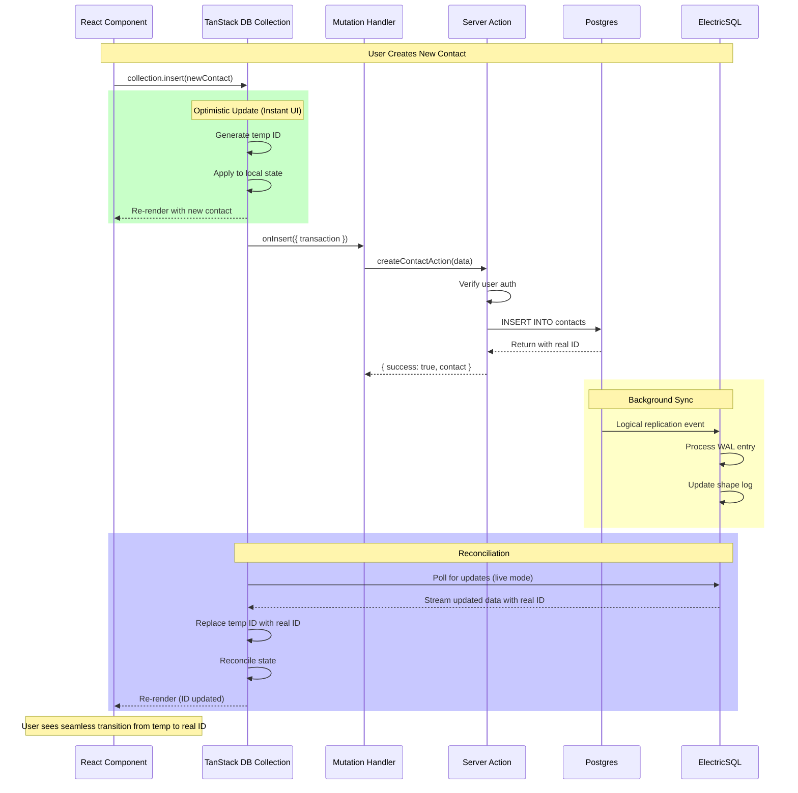
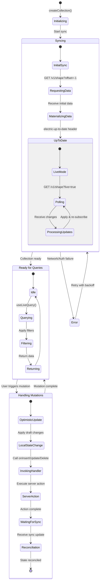
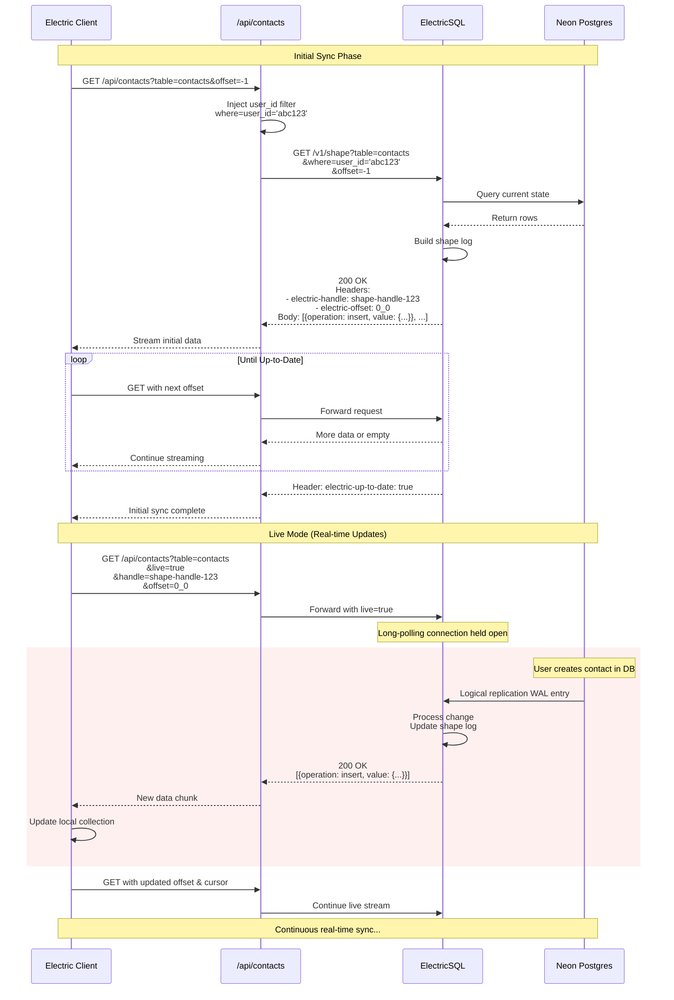

# Architecture Diagrams

This document provides visual diagrams explaining the real-time sync architecture of this contacts application.

## Table of Contents

- [Overall System Architecture](#overall-system-architecture)
- [Authentication Flow](#authentication-flow)
- [Real-time Sync Architecture](#real-time-sync-architecture)
- [Mutation Flow with Optimistic Updates](#mutation-flow-with-optimistic-updates)
- [Collection Lifecycle](#collection-lifecycle)
- [Component Data Flow](#component-data-flow)
- [ElectricSQL Shape Streaming](#electricsql-shape-streaming)

---

## Overall System Architecture

This diagram shows the complete architecture with all major components and their interactions.



---

## Authentication Flow

Shows how Stack Auth integrates with the data access layer to ensure user-scoped data.



---

## Real-time Sync Architecture

Illustrates the four-layer sync architecture: Postgres → ElectricSQL → TanStack DB → UI.

```mermaid
flowchart LR
    subgraph Layer1["Layer 1: Source of Truth"]
        Postgres[(Neon Postgres<br/>with Logical<br/>Replication)]
    end

    subgraph Layer2["Layer 2: Sync Engine"]
        Electric[ElectricSQL Cloud<br/>HTTP Shape API]
        LogRep[Logical Replication<br/>Consumer]
        ShapeLog[Shape Log<br/>Stream]
    end

    subgraph Layer3["Layer 3: Client Store"]
        ShapeProxy[Next.js API Proxy<br/>/api/contacts]
        ElectricClient[Electric Client<br/>ShapeStream]
        Collection[TanStack DB<br/>Collection]
        Handlers[Mutation Handlers<br/>onInsert/Update/Delete]
    end

    subgraph Layer4["Layer 4: Reactive UI"]
        LiveQuery[useLiveQuery Hook]
        Components[React Components]
    end

    Postgres -->|logical replication| LogRep
    LogRep -->|process WAL| ShapeLog
    ShapeLog -->|HTTP streaming| Electric

    Electric -->|GET /v1/shape| ShapeProxy
    ShapeProxy -->|user-filtered stream| ElectricClient
    ElectricClient -->|materialize| Collection

    Collection -->|reactive subscriptions| LiveQuery
    LiveQuery -->|re-render on change| Components

    Components -.->|mutations| Handlers
    Handlers -.->|server actions| Postgres

    style Layer1 fill:#f9f9f9
    style Layer2 fill:#e3f2fd
    style Layer3 fill:#fff3e0
    style Layer4 fill:#e8f5e9
```



---

## Mutation Flow with Optimistic Updates

Demonstrates how mutations work with optimistic updates and server reconciliation.



---

## Collection Lifecycle

Shows the complete lifecycle of a TanStack DB Collection with ElectricSQL.



---

## Component Data Flow

Illustrates how data flows through React components using `useLiveQuery`.

```mermaid
flowchart TD
    Start([User Opens Page]) --> Mount[Component Mounts]

    Mount --> UseLiveQuery["useLiveQuery({<br/>collection: contactCollection,<br/>filter: or(ilike(...), ...)<br/>})"]

    UseLiveQuery --> Subscribe[Subscribe to Collection]
    Subscribe --> CheckReady{Collection<br/>Ready?}

    CheckReady -->|No| ShowLoading[Display Loading State]
    ShowLoading --> WaitReady[Wait for Sync]
    WaitReady --> CheckReady

    CheckReady -->|Yes| GetData[Get Current Data]
    GetData --> ApplyFilter[Apply Filter/Sort]
    ApplyFilter --> RenderUI[Render Contact List]

    RenderUI --> WaitEvent{User Action?}

    WaitEvent -->|Search| UpdateFilter[Update Filter State]
    UpdateFilter --> ApplyFilter

    WaitEvent -->|Create| CreateMutation["collection.insert({<br/>id, name, email, ...<br/>})"]
    CreateMutation --> OptimisticUI[Update UI Instantly]
    OptimisticUI --> ServerSync[Sync to Server]
    ServerSync --> ShapeUpdate[ElectricSQL Sends Update]
    ShapeUpdate --> CollectionUpdate[Collection Reconciles]
    CollectionUpdate --> Resubscribe[Trigger Subscription]
    Resubscribe --> ApplyFilter

    WaitEvent -->|Update| UpdateMutation["collection.update(id, draft => {<br/>draft.name = newName<br/>})"]
    UpdateMutation --> OptimisticUI

    WaitEvent -->|Delete| DeleteMutation[collection.delete(id)]
    DeleteMutation --> OptimisticUI

    WaitEvent -->|External Change| ExternalSync[Another Client Mutates]
    ExternalSync --> ShapeUpdate

    RenderUI --> Unmount{Component<br/>Unmounts?}
    Unmount -->|Yes| Cleanup[Unsubscribe]
    Cleanup --> End([End])
    Unmount -->|No| WaitEvent

    style OptimisticUI fill:#90EE90
    style ServerSync fill:#FFD700
    style CollectionUpdate fill:#87CEEB
```

---

## ElectricSQL Shape Streaming

Details the HTTP Shape API streaming protocol used by ElectricSQL.



---

## Key Concepts

### TanStack DB Collection

- **Reactive store**: Automatically notifies subscribers when data changes
- **Optimistic updates**: Apply changes instantly to UI before server confirmation
- **Mutation handlers**: `onInsert`, `onUpdate`, `onDelete` persist changes to server
- **Automatic reconciliation**: Syncs server state back to local state

### ElectricSQL

- **Shape**: A filtered view of database table(s) that syncs to clients
- **HTTP Shape API**: RESTful streaming protocol using `offset` and `handle` parameters
- **Logical replication**: Postgres WAL (Write-Ahead Log) streaming for real-time updates
- **Live mode**: Long-polling HTTP connections for continuous sync

### Server Actions Pattern

- All mutations go through Next.js server actions
- User authentication verified on every mutation
- Row-level security enforced by `userId` filtering
- Returns `{ success, data/error }` response format

### Data Flow Summary

1. **Write Path**: Component → Collection → Mutation Handler → Server Action → Postgres
2. **Read Path**: Postgres → ElectricSQL → Shape Proxy → Electric Client → Collection → useLiveQuery → Component
3. **Sync Path**: After write, ElectricSQL detects change and streams update back through Read Path

---

## Performance Characteristics

### Optimistic Updates
- **UI Latency**: ~0ms (instant)
- **Server Confirmation**: ~100-500ms (network + DB write)
- **Sync Propagation**: ~50-200ms (ElectricSQL processing + streaming)

### Real-time Sync
- **Initial Sync**: Depends on data size (typically <1s for small datasets)
- **Live Updates**: Near real-time (~50-200ms from DB write to all clients)
- **Polling**: Long-polling keeps connection open, no unnecessary requests

### Scalability
- **Client-side**: Collections cached in memory, reactive subscriptions
- **Server-side**: ElectricSQL handles fan-out, Next.js handles auth/filtering
- **Database**: Postgres logical replication slot per shape

---

## Security Model

### Authentication Layer (Stack Auth)
- Cookie-based session management
- Token validation on every server action
- Automatic redirect for unauthenticated users

### Authorization Layer (Row-Level Security)
- Every shape filtered by `user_id='...'` in SQL `WHERE` clause
- Server actions verify `userId` matches authenticated user
- Update/Delete operations check ownership before executing

### Data Isolation
- Users can only sync shapes containing their own data
- Cross-user data access prevented at proxy level
- Even if client tampers with requests, server enforces filtering
